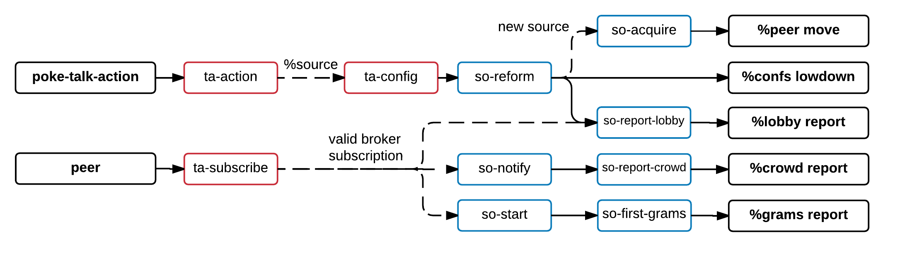
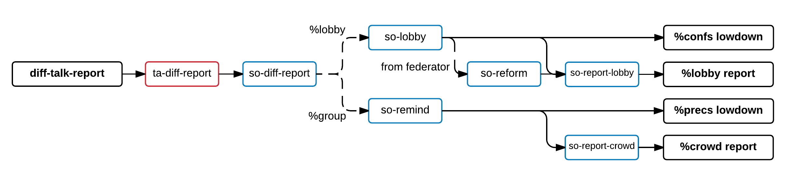
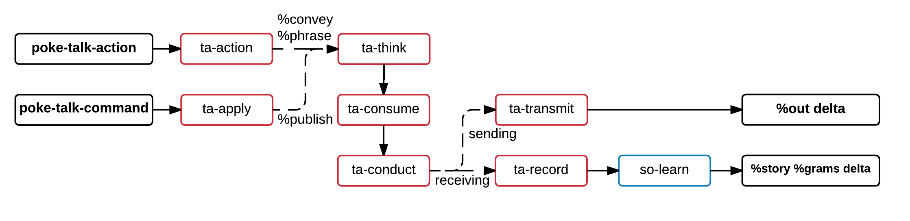

# Talk architecture

This document is complemented by talk's source code, but doesn't require it. Definitions of data structures, code snippets and diagrams will be provided where useful.

## Table of contents

* [Overview](#overview)
* [Structures & functionality](#structures--functionality)
  * [Partners](#partners)
  * [Messages](#messages)
  * [Metadata](#metadata)
  * [Access control](#access-control)
  * [Federation](#federation)
  * [Stories](#stories)
  * [General use](#general-use)
* [Interfaces for applications](#interfaces-for-applications)
  * [Interactions](#interactions)
  * [Subscriptions](#subscriptions)
* [Communication between brokers](#communication-between-brokers)
  * [Interactions](#interactions-1)
  * [Subscriptions](#subscriptions-1)
* [Broker implementation](#broker-implementation)
  * [Subscriptions](#subscriptions-2)
  * [Reports](#reports)
  * [Messaging](#messaging)
* [The future](#the-future)
  * [Architectural issues](#architectural-issues)
  * [Features and functionality](#features-and-functionality)
* [Further reading](#further-reading)

## Overview

Talk was Urbit's first big user-facing application, and continues to enjoy a prominent role in the Urbit landscape as the primary messaging bus.

To be clear, we make a distinction between "talk the platform" and "talk the chat application". The latter makes use of the former for most of its functionality, and serves as an example of things that can be built on top of the platform. (Also see the small Twitter clone, [feed](http://urbit.org/fora/posts/~2017.4.12..21.14.00..fe17~/).)  
This document, however, focusses on the platform. In talk's case, we refer to this "server" (or `guardian`, in Urbit terminology) as the *broker*. It manages an identity's messages, subscriptions, and more.


## Structures & functionality

### Partners

One of the broker's strengths is that it can not only interface with other brokers, but also external services. We define a single structure that can be used to specify both kinds of messaging targets.

```
++  partner    (each circle passport)                   :<  message target
++  circle     {hos/ship nom/knot}                      :<  native target
++  passport                                            :>  foreign target
  $%  {$twitter p/cord}                                 :<  twitter handle
  ==                                                    ::
```

A `partner` is either a `circle` or a `passport`. A `circle` is a native partner, essentially a named collection of messages created by and hosted on a ship's broker, usually represented as `~ship-name/circle-name`.  
A `passport` is a non-native partner, such as a Twitter feed. The possibilities for passports are endless... but none of them are properly implemented yet. For the rest of this document we'll assume a `partner` is always a `circle`.

### Messages

When we subscribe to a circle, the primary thing we're interested in is its messages. Message data itself isn't that complicated, but a fair amount of metadata comes into play when actually sending a message. Let's work our way up, starting at the contents.

```
++  speech                                              :>  narrative action
  $%  {$lin pat/? msg/cord}                             :<  no/@ text line
      {$ire tos/serial sep/speech}                      :<  in-reply-to
      {$url url/purf}                                   :<  parsed url
      {$app app/term msg/cord}                          :<  app message
      {$ext nom/term dat/*}                             :<  extended action
      ::  ...                                           ::
  ==                                                    ::
```

At the heart of every message lies a `speech` that describes the message contents. There's a large number of different speech types, from simple text messages to parsed URLs, Hoon expressions and more. Thought the system strives to accommodate all use cases, the `%ext` speech type provides some extensibility for applications that feel their needs aren't covered.

```
++  statement  {wen/@da boq/bouquet sep/speech}         :<  when this
++  bouquet    (set flavor)                             :<  complete aroma
++  flavor     path                                     :<  content flavor
```

Message contents are wrapped in a `statement` which specifies its timestamp and the `flavor` of its content, ¿¿¿ which can be used to filter out content they prefer not to see. ???

```
++  audience   (map partner (pair envelope delivery))   :<  destination + state
++  envelope   {vis/? sen/(unit partner)}               :<  visible sender
++  delivery                                            :>  delivery state
  $?  $pending                                          :<  undelivered
      $received                                         :<  delivered
      $rejected                                         :<  undeliverable
      $released                                         :<  sent one-way
      $accepted                                         :<  fully processed
  ==                                                    ::
```

When specifying a message's destination, an `audience` is used. It contains all the recipients of the message, as well as the delivery state for each of those recipients.

```
++  telegram   {aut/ship tot/thought}                   :<  who thought
++  thought    {uid/serial aud/audience sam/statement}  :<  which whom what
++  serial     @uvH                                     :<  unique identifier
```

The message and its destination get put into a `thought`, which also carries a universally unique identifier. This way, recipients can easily check whether they're receiving a new message or a potentially modified version of an existing one.  
Finally, all this gets put into a `telegram` which tags it with the message's author.

### Metadata

Messages aren't the only thing a subscription gets us. We're also kept up to date with relevant metadata.

```
++  crowd      {loc/group rem/(map partner group)}      :<  our & srcs presences
++  group      (map ship status)                        :<  presence map
++  status     {pec/presence man/human}                 :<  participant
++  presence                                            :>  status type
  $?  $gone                                             :<  left
      $idle                                             :<  idle
      $hear                                             :<  present
      $talk                                             :<  typing
  ==                                                    ::
++  human                                               :>  human identifier
  $:  tru/(unit (trel cord (unit cord) cord))           :<  true name
      han/(unit cord)                                   :<  handle
  ==                                                    ::
```

`status` is user-set metadata that describes, well, the status of users in a circle. This encompasses their `presence`, which shows their activity, and their `human` identity, which includes their display handle.  
For reasons we'll discover shortly, circles keep track of both their own `group` and those of the partners they're subscribed to. `crowd` encapsulates this.

```
++  lobby      {loc/config rem/(map circle config)}     :<  our & srcs configs
++  config                                              :>  circle config
  $:  src/(set partner)                                 :<  pulls from
      cap/cord                                          :<  description
      con/control                                       :<  restrictions
      fed/federal                                       :<  federators
  ==                                                    ::
++  control    {sec/security ses/(set ship)}            :<  access control
++  federal    {may/(set ship) fes/(set ship)}          :<  federation control
```

Another part of metadata we get from circle subscriptions is configurations. Again, circles want to remember their own configuration, as well as those of their subscriptions. But why, precisely?

The `config` structure contains `src`, a set of partners. These indicate the different sources a circle may pull content from. This allows circles to aggregate messages from multiple places. In doing so, it also receives metadata from those places, hence why we have structures for storing "remote" presences and configurations alongside local ones.

Aside from a description, a configuration also contains structures to define access and federation control. They're important parts of functionality in their own right, so they get their own sections below.

### Access control

A `control` structure contains both a security mode and a list of ships, which is either a white- or blacklist depending on the aforementioned mode. There are four such modes available.

```
++  security                                            :>  security mode
  $?  $black                                            :<  channel, blacklist
      $white                                            :<  village, whitelist
      $green                                            :<  journal, author list
      $brown                                            :<  mailbox, our r, bl w
  ==                                                    ::
```

A `channel` is publicly readable and writable, with a blacklist for blocking.  
A `village` is privately readable and writable, with a whitelist for inviting.  
A `journal` is publicly readable and privately writable, with a whitelist for authors.  
A `mailbox` is readable by its owner and publicly writable, with a blacklist for blocking.

### Federation

One of the primary aspects of Urbit is its decentralized nature. To make full use of that, the broker can federate circles. That is, circles can be hosted on multiple ships simultaneously. They share all messages, presence and configuration, regardless of where that data or change originated.  
This can help spread heavy load across multiple ships, makes circles easier to access, and allows for fallback in case one of the hosts goes offline.

The `fed` configuration attribute is used to determine which ships are allowed to federate a circle, and keep track of the ones that are currently doing so.


### Stories

To see how that all ties together, we're going to take a look at the broker's state.

```
++  state                                               :>  broker state
  $:  stories/(map knot story)                          :<  conversations
      ::  ...                                           ::
  ==                                                    ::
++  story                                               :>  wire content
  $:  grams/(list telegram)                             :<  all messages
      locals/group                                      :<  local presence
      remotes/(map partner group)                       :<  remote presence
      shape/config                                      :<  configuration
      mirrors/(map circle config)                       :<  remote config
      ::  ...                                           ::
  ==                                                    ::
```

Stories are the primary driver behind the broker. They are the structures that are used to power circles, which we can now say are named stories hosted on ships.

With the configuration described above in mind, we can try and imagine the things we can do with stories. Knowing that we can subscribe them to any number of sources, they can function as central hubs for our messaging, aggregate specific kinds of data feeds, or simply accept whatever messages get sent to it like a regular old chatroom.

### General use

Upon initial startup, the broker creates a default story, a mailbox named `porch`. (This name is different for stars and galaxies.) This mailbox is the primary target for anyone and anything that wants to reach its owner. Applications can use it to send notifications and other information to the user (the broker itself does this as well), and users can use it to direct-message others.

Talk reader applications are encouraged to use the default mailbox as the primary messaging hub. This way, users can easily switch between different applications without "losing" their subscriptions, message backlog, etc.

As an example, the "official" talk reader operates like this, serving as an interface for reading from and managing the user's mailbox. Local stories are subscribed to through the `porch`, which ends up containing all messages the user receives.


## Interfaces for applications

Applications can interact with the broker in two complementary ways: they can tell it what actions to perform, and they can subscribe to its state changes.

### Interactions

The broker can be commanded by poking it with `action`s.

```
++  action                                              :>  user action
  $%  ::  circle configuration                          ::
      {$create nom/knot des/cord sec/security}          :<  create circle
      {$delete nom/knot ano/(unit cord)}                :<  delete + announce
      {$depict nom/knot des/cord}                       :<  change description
      {$permit nom/knot inv/? sis/(set ship)}           :<  invite/banish
      {$source nom/knot sub/? src/(set partner)}        :<  un/sub to/from src
      {$enlist nom/knot fed/? sis/(set ship)}           :<  dis/allow federation
      {$burden circle}                                  :<  help federate
      ::  messaging                                     ::
      {$convey tos/(list thought)}                      :<  post exact
      {$phrase aud/(set partner) ses/(list speech)}     :<  post easy
      ::  personal metadata                             ::
      {$status cis/(set circle) sat/status}             :<  our status update
      ::  changing shared ui                            ::
      {$human sip/ship man/human}                       :<  new identity
      {$glyph gyf/char pas/(set partner) bin/?}         :<  un/bind a glyph
  ==                                                    ::
```

The largest part of these actions concern themselves with managing local circles. `nom` is always the name used to identify the relevant story. To disambiguate between "add" and "delete" type actions (for permissions, subscriptions and federation), a loob `?` is used.

To send messages, two interfaces are available. `%convey` lets you specify all details of the messages, including its timestamp, serial, and fully assembled audience. `%phrase`, on the other hand, takes care of that for you, allowing you to specify just the target partners and message contents.

`%status` is useful for setting your own presence and nickname in a circle, so others can see if you're active.

> **Current implementation** implements a `%status` command that only works for local circles.

"Shared UI" encompasses UI data that should be consistent across applications. For example, if the user sets a local nickname for an identity, they expect to see that nickname regardless of the application they're currently using. The same goes for glyph bindings, for easy audience targeting.

Sometimes, in response to a user action, the broker will respond with a `reaction`.

```
++  reaction                                            :>  user information
  $:  res/?($info $fail)                                :<  result
      wat/cord                                          :<  explain
      why/(unit action)                                 :<  cause
  ==                                                    ::
```

These are used to inform the application (and thus the user) of any unexpected side effects or errors that occurred as a result of the action they issued.

### Subscriptions

To receive data from a broker, applications will have to subscribe to it. A `%peer` move for doing so looks something like this:

```
:*  ost.bol                                             :<  bone
    %peer                                               :<  move type
    /story/[some-story]                                 :<  diff path
    [our %broker]                                       :<  peer target
    /reader/[some-story]                                :<  peer path
==                                                      ::
```

The diff path is for the application to use to identify what subscription a diff came from. That is, what story the diff relates to. Not all applications will care for this.  
The peer path informs the broker of the intent of the subscription. It always starts with `/reader` to indicate we're a client application, not another broker. If the path ends there, it subscribes to shared UI changes. If it goes on to specify a story name, it subscribes to changes to that story.

These changes get sent as `lowdown`s.

```
++  lowdown                                             :>  new/changed state
  $%  ::  story state                                   ::
      $:  $confs                                        :<  configs
          loc/(unit config)                             :<  local config
          rem/(map circle (unit config))                :<  remote configs
      ==                                                ::
      {$precs reg/crowd}                                :<  presences
      {$grams num/@ud gaz/(list telegram)}              :<  messages
      ::  ui state                                      ::
      {$glyph (jug char (set partner))}                 :<  glyph bindings
      {$names (map ship (unit human))}                  :<  nicknames
  ==                                                    ::
```

Aside from the initial lowdown that is sent when a subscription starts, these contains exclusively the changes as they occur. Configurations are wrapped in `unit`s so that deletion can be indicated. This also means that simple applications don't necessarily need to keep state. If all they want to do is show events as they happen, then the broker subscription will provide all they need.


## Communication between brokers

Brokers can communicate with other brokers to send commands and subscription updates.

### Interactions

To request changes to a story, brokers can send `command`s.

```
++  command                                             :>  effect on story
  $%  {$review tos/(list thought)}                      :<  deliver
      $:  $burden                                       :<  starting fed state
          nom/knot                                      ::
          cof/lobby                                     ::
          pes/crowd                                     ::
          gaz/(list telegram)                           ::
      ==                                                ::
      {$relief nom/knot who/(set ship)}                 :<  federation ended
  ==                                                    ::
```

A `%review` command contains messages. These are sent to foreign brokers to be published to one of their stories.

`%burden` and `%relief` commands are used for federation. The former signals the sender wants to start federating story `nom`, and contains any pre-existing state that needs to be merged into it. The latter signals that the hosts in `who` will no longer be federating the story.

### Subscriptions

Brokers subscribe to other brokers whenever a source gets added to a story's configuration. (Likewise, they unsubscribe when a source is removed.) Here's the peer move we send when we start a subscription:

```
:*  ost.bol                                             :<  bone
    %peer                                               :<  move type
    /friend/show/[our-circle]/[host]/[their-circle]     :<  diff path
    [host %broker]                                      :<  peer target
    /[their-circle]/[start]/[end]                       :<  peer path
==                                                      ::
```

Again, the diff path is just what our broker uses to identify what subscription a received message originates from. The peer path is more interesting. Of course it specifies the name of their story we want to subscribe our story to, but also a "start" and "end". These can be used to specify how long we want our subscription to last. Maybe we want messages starting from last week, up to the end of the month. We may also specify message numbers instead of dates, if we're so inclined.

For as long as their subscriptions last, subscribers get sent `report`s whenever changes occur.

```
++  report                                              :>  update
  $%  {$lobby cab/lobby}                                :<  config neighborhood
      {$crowd reg/crowd}                                :<  presence
      {$grams num/@ud gaz/(list telegram)}              :<  thoughts
  ==                                                    ::
```

There are three different kinds of reports, for configurations, presences, and messages.

Attentive eyes may have seen this in lowdowns as well, they contains both local and remote data. This is required for federation to share full state, and some regular subscribers might take interest in that data as well.


## Broker implementation

Now that we know what gets sent over the wire and why, let's see what happens whenever such events happen. We won't be covering everything, but enough to illustrate the general flow.

First though, it's useful to understand how the broker's code is structured. It consists of two primary cores that are used as engines for applying changes to state and producing moves for output.

* `++ta` is the transaction core. For every event that happens, be it a poke, peer of diff, the transaction core gets put to work to process it. Once it's done, it produces a list of moves and the new state.
* `++so` is the story core, used by `++ta` for applying changes to stories. In doing so, it may add moves to the transaction core for it to produce.

Once all work in an engine core has finished, its `-done` arm is called to produce moves and apply the changes it made back into the application state.

In the diagrams that follow, regular lines indicate flows that always happen. Dashed lines indicate flows that are traversed if the described condition is met.  
Below the diagrams you will find brief explanations of the involved arms. In a particularly bright future, these might be available on-hover instead.  
For brevity, utility arms that aren't a direct and important part of the flow have been omitted.

### Subscriptions

Broker-to-broker subscriptions happen when a source gets added to a story. This is done with a `%source` action, and results in a `%peer` move being sent. Upon receiving a peer, the broker validates the subscription and sends the current state.



```
++  poke-talk-action        :<  we got poked with an action.
  ++  ta-action             :<  applies an action.
  ++  ta-config             :<  (re)configures a story.
  ++  so-reform             :<  changes the configuration of the story.
    ++  so-acquire          :<  subscribes the story to new sources.
::                          ::
++  peer                    :<  we got peered.
  ++  ta-subscribe          :<  sends initial data: current state.
  ++  so-report-lobby       :<  sends a report with configurations.
  ++  so-notify             :<  changes a ship's presence in the story.
    ++  so-report-crowd     :<  sends a report with presences.
  ++  so-start              :<  determines the backlog of messages to send.
    ++  so-first-grams      :<  sends a range of messages and adds follower.
```

### Reports

Once a subscription has been established, the broker will receive reports. `%lobby` and `%group` reports are applied through the following flow. Note how, when a `%lobby` from a federating ship is received, this authoritatively changes the story's configuration.



```
++  diff-talk-report        :<  we got a subscription report.
  ++  ta-diff-report        :<  applies a report to the story it's intended for.
  ++  so-diff-report        :<  applies a report.
    ++  so-lobby            :<  stores updated configuration.
      ++  so-reform         :<  changes the configuration of the story.
      ++  so-report-lobby   :<  sends a report with configuration.
    ++  so-remind           :<  stores updated presences.
      ++  so-report-crowd   :<  sends a report with presences.
```

### Messaging

To send messages, the user sends a `%convey` or `%phrase` action, resulting in a `%review` command being sent to the involved partners. Receiving a `%review` command causes its messages to be added to the story, which sends a `%grams` report to subscribers and a `%grams` lowdown to all reader applications.



```
++  poke-talk-action        :<  we got poked with an action.
  ++  ta-action             :<  applies an action.
::                          ::
++  poke-talk-command       :<  we get poked with a command.
  ++  ta-apply              :<  applies a command.
  ++  ta-think              :<  consumes each message in the given list.
  ++  ta-consume            :<  conducts a message to each partner in audience.
  ++  ta-conduct            :<  records or sends a message.
    ++  ta-transmit         :<  sends a message to a partner.
    ++  ta-record           :<  stores a message in a story.
::                          ::
++  diff-talk-report        :<  we got a subscription report.
  ++  ta-diff-report        :<  applies a report to the story it's intended for.
  ++  so-diff-report        :<  applies a report.
  ++  so-lesson             :<  learns a list of messages.
    ++  so-learn            :<  either adds or modifies a message.
      ++  so-append         :<  adds a new message to the story.
      ++  so-revise         :<  modifies an existing message in the story.
    ++ so-refresh           :<  sends messages to all interested subscribers.
```


## The future

Talk is neither complete nor perfect. There are still problems that need to be solved and features that need to be implemented.

### Architectural issues

To distribute commands and reports to all that are affected by it, the broker takes a "propagate changes" approach. If, in processing a report, any state changes, new state gets sent to all interested brokers... even those it got the report from in the first place. This results in a lot of unnecessary data transfer, where everyone always gets notified of each other's state changes, regardless of whether those changes are old news or not.

While not a practical problem (yet, things work fine at the current scale of use), it does underline the need for a more structured approach to the broker's subscription model. In an ideal world, every interested node gets notified of a set of changes exactly once.

That still becomes unwieldy for circles that have thousands of subscribers, since a single node would still be sending thousands of network events. An obvious potential solution is to apply Urbit's hierarchical structure to this, and send messages to stars for them to send to their children.

While on the topic of subscriptions, the current implementation treats them as semantic data, explicitly storing them in application state. It would be desirable to push this to the background again.

### Features and functionality

To turn talk into a [sustainable social platform](https://urbit.org/fora/posts/~2017.4.26..18.00.25..b93c~/), it needs a number of things.

Primarily, discoverability of circles. A possible solution for realizing this is making it possible for users to add friends, which would have their broker subscribe to a list of circles the added friends are in. Of course, one will be able to set joined circles as "private" to keep them from being visible to others.

Eventually, content self-moderation might need to be implemented. Users would flag their content if it is potentially offensive. Others would easily be able to filter out content that might offend them.  
This functionality brings its own large sets of challenges that need to be tackled.

Additionally, federation might be put to broader use. Knowing a circle is federated could help fall back to alternative hosts in case the one the broker originally subscribed to is unavailable.  
Implementation-wise, care would need to be taken for this to not get ugly. Not to mention, when/how would availability of a host be verified?

Smaller functionality that still needs to be implemented includes:
* Extended permissions management. Being able to black-/whitelist entire ship classes.
* Improved presence functionality. Actually using the presence system, and sending "typing", "idle", etc. statuses.
* Per-circle message rules. Dis/allow unicode, enforce line length, etc.
* Flexible on-subscribe scrollback. Some cases may want more than just a day's worth.
* Talkpolls.


## Further reading

To gain a more thorough understanding of the broker's inner workings, take a look at its source code. It comes with inline documentation.  
[link]

To see an expansive example of an application that uses the broker, take a look at the code of the talk reader. This, too, comes with inline documentation.  
[link]
