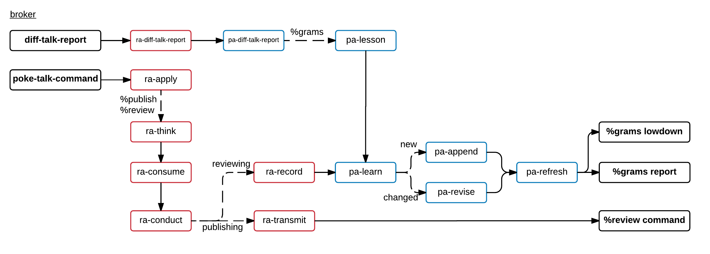
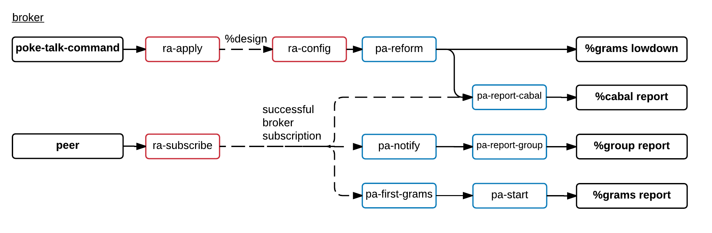
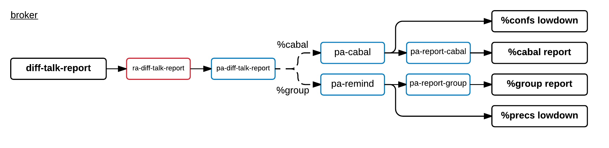
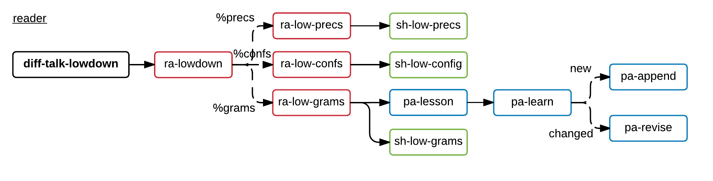
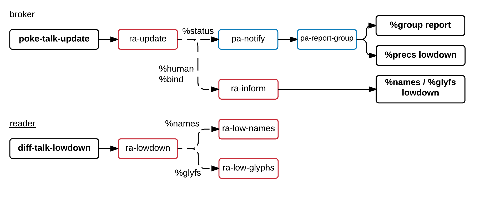

# Talk
## Architecture

##### notes to self

Justify everything!

Include proposed changes:
* mirror config and state for local stories into remotes, allowing for:
  * less different lowdowns,
  * no more config/locals in tales in reader,
  * potentially no config/locals in stories, simplifying and clarifying.
* something to do with the mailbox story, also see above.
* something to allow federation?


This document is complemented by talk's source code. Definitions of data structures will be provided where useful. Descriptions of processes will be accompanied by diagrams describing this flow in code arms. [@TODO? For more detailed explanations, see the implementation overview at the end of this document.]

***Current implementation*** *remarks mention where the [current implementation](https://github.com/Fang-/arvo/tree/talk-split) differs from what is described, and why changing that to match this document would be desirable.*

### Overview

Talk has been split into two, because x y z.  
Official Urbit terminology calls these the `guardian` (like a unix daemon) and `agent`. To be more semantically appropriate for talk, we're calling them `broker` and `reader` respectively.

#### Partners

```
++  partner    (each station passport)                  ::  interlocutor
```

A `partner` is either a `station` (a "chat room" hosted on a ship, represented as `~ship-name/station-name`) or a `passport`, which represents a non-station target. An example of a passport is a Twitter handle. Since passports aren't yet fully implemented for any kind of usage, we'll ignore them for now.


### Broker

The broker is responsible for all primary talk functionality, everything that happens "under the hood". It can send, receive and store messages, keeps track of presence lists and configurations, and manages the stations you've created.

Note: *You may see `lowdown`s as output in some of the arm flows. These are sent to readers. Their purpose is described later in this document.*

#### General messaging flow (broker to broker)

```
++  command                                             ::  effect on party
  $%  {$publish (list thought)}                         ::  originate
      {$review (list thought)}                          ::  deliver
      ::  ...                                           ::
  ==                                                    ::
++  thought    (trel serial audience statement)         ::  which whom what
++  report                                              ::  talk update
  $%  {$grams (pair @ud (list telegram))}               ::  beginning thoughts
      ::  ...                                           ::
  ==                                                    ::
```

Posting a message is done by poking your own broker with a `%publish` `command`, which prompts the broker to verifies that command originated from someone in its `team` (its own ship, or one of its moons), and to actually publish it.

Having received and verified the command to publish a message, your broker sends a `%review` `command` to the brokers of all members of the `audience`. That is, all ships of the stations in the audience. (Again, messaging to other kinds of partners isn't implemented yet.)

Upon getting poked with a command to review a message, a broker seeks out the appropriate story and (after checking if the sender has write permissions) adds the message to the story. Doing this causes a `%grams` `report` to be sent to everyone that has subscribed to that story.

When a broker gets a diff ("subscription poke") with a `%grams` report, it adds all messages in it to the appropriate story.



#### Stories (broker to broker)

```
++  story                                               ::  wire content
  $:  count/@ud                                         ::  (lent grams)
      grams/(list telegram)                             ::  all history
      locals/atlas                                      ::  local presence
      sequence/(map partner @ud)                        ::  partners heard
      shape/config                                      ::  configuration
      known/(map serial @ud)                            ::  messages heard
      followers/(map bone river)                        ::  subscribers
  ==                                                    ::
```

A `story` is the structure in which a station's full state is stored. Its the canonical source for its messages, configuration, presence and subscribers.

##### Telling stories

```
++  house                                               ::  broker state
  $:  stories/(map knot story)                          ::  conversations
      ::  ...                                           ::
  ==                                                    ::
++  command                                             ::  effect on party
  $%  {$design (pair knot (unit config))}               ::  configure+destroy
      ::  ...                                           ::
  ==                                                    ::
```

To create a station, you send a `%design` command to your broker, containing the name of the station and its initial configuration. After verifying you are in the broker's team, it sets the configuration for a story with the specified name, creating that story if it doesn't yet exist.

When people subscribe to a station it sends a `%peer` to the station's ship's broker. In the subscription path, the name of the station is specified, as well as the range of the subscription. For example, a subscriber may only be interested in messages up to a month from now.  
***Current implementation*** *always gets you messages from up to a day old, and all messages after that. Giving the user the option to specify the range of the subscription should prove useful to future applications of the talk system. The same can be said for making a range enforceable on a per-station basis.*

When a broker gets peered, it checks the source for read permissions on the specified story before adding it to the story's list of subscribers. When this happens, the broker sends a bunch of different reports to the new subscriber to bring them up to speed on configuration, presences and messages of the station.



##### Hearing stories

```
++  house                                               ::  broker state
  $:  remotes/(map partner atlas)                       ::  remote presence
      mirrors/(map station config)                      ::  remote config
      ::  ...                                           ::
  ==                                                    ::
++  report                                              ::  talk update
  $%  {$cabal config}                                   ::  config neighborhood
      {$group atlas}                                    ::  presence
      ::  ...                                           ::
  ==                                                    ::
```

When subscribing, no stories are created. A story is the one true canonical source of a station, there can only be one. So where does a subscriber keep a station's messages and other data?

Every instance of a talk broker comes with a default mailbox. For planets, this is their `%porch`. It can be written to by everyone, but only read by its owner. The mailbox is used to store *all* incoming messages from *all* subscriptions. This means that if you are subscribed to a station you host, messages will be stored in both the station's story *and* your mailbox.

Presence lists and configurations of stations you've joined are stored in maps in the broker's general state. These are updated whenever a `%cabal` or `%group` `report` is received. Such updates are sent to all subscribers of a story whenever changes occur.  
***Current implementation*** *doesn't store presence and config of local stations in the maps, instead keeping this strictly in the stories themselves. Also adding local story presences and configs to the global maps would help simplify communication with readers and readers themselves. (See also "Reader" below.)*  
***Current implementation*** *includes remote presences and configs in `%cabal` and `%group` reports. Leaving those out should not hinder functionality. "But federation?" No party in a federation scenario should care where presence/config originated.*



### Reader

A reader is an application used for interfacing with a talk broker. As such, it communicates solely with the broker of the identity it is associated with. No other brokers. No other readers. That is all left up to the broker itself.

***Current implementation*** *still stores different tales (subsets of stories). Ideally, and taking the changes described below into account, readers should be able to get away with a single list of messages and maps for presences and configurations. Practically, you could say it's like subscribing to the broker's mailbox and the changes made to broker's presence and config lists.*

#### Staying informed (broker to reader)

```
++  lowdown                                             ::  reader update
  $%  {$confs (map station (unit config))}              ::  changed config
      {$precs (map partner atlas)}                      ::  changed presence
      {$grams (pair knot (pair @ud (list telegram)))}   ::  new grams
      ::  ...                                           ::
  ==                                                    ::
```

As silently illustrated in the flow diagrams shown earlier in this document, `lowdown`s may get sent whenever something about a story changes: new or changed messages (`%grams`), presence (`%precs`) or configuration (`%confs`). Those lowdowns contain exclusively the changes compared to what the reader knows. When it first boots up, this is all state of all the broker's subscriptions. Afterwards, this is just whatever change the broker recently recorded.  
***Current implementation*** *has many more lowdowns, which include different lowdowns for local and remote station changes. Taking the changes described above into account (ditching tales for simpler storage) would make it possible to simplify reader state and the lowdowns that update it considerably.*  
***Current implementation*** *sends much more than just the change for most lowdowns, often sending the entire new state. This places the burden of calculating the differences with the reader, even though the broker had that information readily available. Sending the change alone would free the reader from the required logic, and potentially allow the reader to stop mirroring broker state altogether. Reports might also be updated to behave this way. If needed, ++scry arms could be added to the broker for (hopefully infrequent) state access.*



#### Changing shared UI (reader to broker to reader)

```
++  update                                              ::  change shared state
  $%  {$status (pair (set knot) status)}                ::  our status update
      {$human (pair ship human)}                        ::  new identity
      {$bind (pair char (set partner))}                 ::  bind a glyph
  ==                                                    ::
++  lowdown                                             ::  reader update
  $%  {$glyfs (jug char (set partner))}                 ::  new bindings
      {$names (map ship (unit human))}                  ::  new identities
      ::  ...                                           ::
  ==                                                    ::
```
@TODO maybe update the above molds a bit to better fit the "send only diffs" design?  
@TODO status per partner, not per story, right?

@TODO  
Sometimes when a user changes something about their UI, we want that to synchronize across all readers. This includes nicknames and glyph bindings. Also, status changes.  
Broker receives these updates, processes them, then propagates to all readers.



### Implementation overview

@TODO per core: task/subject, important arms, general flow description

We're not going to be explaining talk's usage of cores here. ~~Please see the "core shenanigans" document for that.~~

#### `++ra` transactions
#### `++pa` stories/tales
#### `++sh` shell
#### `++sn` station rendering
#### `++ta` partner rendering
#### `++te` audience rendering
#### `++tr` telegram rendering

@TODO insert/link to arm flow diagrams
