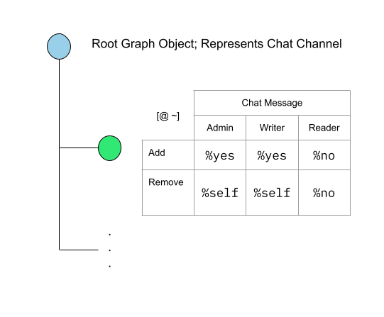
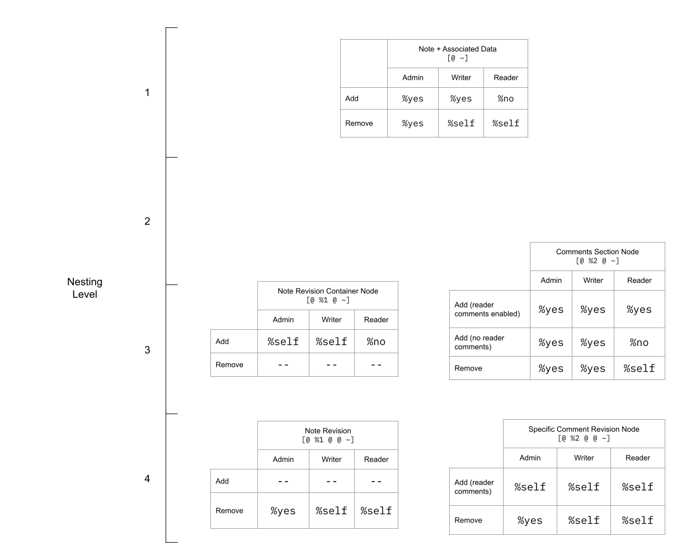

+++
title = "Validator Walkthrough"
weight = 3
sort_by = "weight"
template = "doc.html"
insert_anchor_links = "right"
+++


## Schema and Permissioning Implementation
In this section, we will analyze various applications and see how they implement their schema and permissions.


### Current State of Permissioning
Please note that as it stands today, the current permissioning system is likely subject to change. It is by no means the only manner in which to set up permissionings. For many applications, writing a small and bespoke permissioning library may be suitable as an alternative to the `graph-push-hook` permissioning scheme which is what will be covered in the following examples.

Also, please be aware that the current set of applications use a special type known as `vip-metadata`, which stands for "variation in permission".
It is extra metadata attached to a post that is available to the permissioning arms that is mainly used to specify whether reader comments are enabled or disabled.
Here's the source if you want to explore: [`sur/metadata-store.hoon#L20-L30`](https://github.com/urbit/urbit/blob/ac096d85ae847fcfe8786b51039c92c69abc006e/pkg/arvo/sur/metadata-store.hoon#L20-L30)


### Chat
#### Schema
Here's what the schema of chat looks like:

<p align="center">
  
</p>

A chat is a flat graph, where all chat messages are nodes appended to the root of the graph.
The graph represents a chat channel and contains all chat messages in order. A chat message is a child node of the root graph.


Here's the definition of the schema in the chat validator mark:
File: [`mar/graph/validator/chat.hoon`](https://github.com/urbit/urbit/blob/fbd85abf4e41d580654606a6defb764f6a97256d/pkg/arvo/mar/graph/validator/chat.hoon#L33-L40)
```
++  grab
  |%
  ++  noun
    |=  p=*                     :: 1
    =/  ip  ;;(indexed-post p)  :: 2
    ?>  ?=([@ ~] index.p.ip)    :: 3
    ip                          :: 4
  --
::
```

Here are the steps:
1. Given a noun (we expect an indexed-post)
1. Try to coerce p to an indexed-post, crash if it doesn't cast
1. Assert that the index of the post of the indexed post is only a single atom, i.e., that it is only nested one level deep
1. Return the indexed post

Notably, under this set of rules, there is no nesting allowed. Put another way, no node is allowed to have any children. Nodes can only be added to the root graph. Step 3 is what enforces the flat hierarchy. If someone were to manually try to submit a node with children, Graph Store would reject it, preventing them from sending an invalid chat message.

Since the schema of the chat application is simple enough, it has no need for structural nodes at all.

#### Permissioning

<p align="center">
  
</p>

Let's take a look at the permissions table in the diagram.

Chat Message `[@ ~]`
- Add Privileges
  - Admins and Writers have `%yes` add permissions for all nodes at the top level, meaning that they have the ability to post chat messages, even if they did not create the chat channel
  - Readers have `%no` add privileges for any nodes at the root level, so they do not have the ability to post chat messages
- Remove Privileges
  - Admins and Writers have `%self` remove privileges, meaning that they may only delete chat messages that they posted, not anyone else's
  - Readers have `%no` remove privileges for any nodes, meaning they cannot delete any chat messages

This follows our general intuition of how permissions for chat messages should be structured.
For example, it wouldn't make sense to give readers `%self`, because they do not have the ability to create nodes in the first place, so they will never be in a position to delete any nodes.

Let's see how this permissioning system is implemented in the validator code.

Here is the `grow` arm of [`mar/validator/chat.hoon`](https://github.com/urbit/urbit/blob/fbd85abf4e41d580654606a6defb764f6a97256d/pkg/arvo/mar/graph/validator/chat.hoon#L7-L20)
```
|_  i=indexed-post              :: A
++  grow
  |%
  ++  graph-permissions-add
    |=  vip=vip-metadata:met    :: 1
    ?+  index.p.i  !!           :: 2
      [@ ~]  [%yes %yes %no]    :: 3
    ==
  ::
  ++  graph-permissions-remove
    |=  vip=vip-metadata:met    :: 4
    ?+  index.p.i  !!           :: 5
      [@ ~]  [%self %self %no]  :: 6
    ==
  ::
  --
::
```

In line A, we accept an `indexed-post` that is used in the rest of the `grow` arm.

`graph-permissions-add`
1. Accept a noun `vip` of type `vip-metadata`
2. Switch on the index of the post found in `i`, crashing if no successful matches occur
3. If the index is nested one level deep
4. Return a `permissions` noun defined as: [admin: %yes, writer: %yes, reader: %no]


    `graph-permissions-remove`

5. Accept a noun `vip` of type vip-metadata
6. Switch on the index, crashing if no successful matches occur
7. If the index is nested one level deep
8. Return a `permissions` noun defined as: [admin: %self, writer: %self, reader: %no]

In this example, a switch statement is used to determine the `permissions` values based on the index of the post.


### Links
#### Schema

<p align="center">
  
</p>

The root graph represents the whole Links collection. Every Links entry is a child node of this graph. Every Links entry is made up of:
- The link and its description
- A comments section


The comments section holds all individual comment nodes, but comments are not simple leaf nodes. An individual comment is actually a structural node that acts as a revision container, storing the comment's full edit history by storing each edit as a child node. The front-end is responsible for properly displaying the latest revision of the comment.


Here's the validator, located at [`mar/graph/validator/link.hoon`](https://github.com/urbit/urbit/blob/fbd85abf4e41d580654606a6defb764f6a97256d/pkg/arvo/mar/graph/validator/link.hoon#L49-L73):
```
++  grab
  |%
  ++  noun
    |=  p=*                                         :: 1
    =/  ip  ;;(indexed-post p)                      :: 2
    ?+    index.p.ip  ~|(index+index.p.ip !!)       :: 3
        ::  top-level link post; title and url
        ::
        [@ ~]                                       :: 4
      ?>  ?=([[%text @] [%url @] ~] contents.p.ip)  :: 4a
      ip
    ::
        ::  comment on link post; container structure
        ::
        [@ @ ~]                                     :: 5
      ?>  ?=(~ contents.p.ip)                       :: 5a
      ip
    ::
        ::  comment on link post; comment text
        ::
        [@ @ @ ~]                                   :: 6
      ?>  ?=(^ contents.p.ip)                       :: 6a
      ip
    ==
  --
```


<ol>
  <li>Get the post as a noun</li>
  <li>Force cast to indexed post</li>
  <li>
    Switch on index of post, crash if no match occurs
    <ol type="a">
      <li>If the node is nested one level deep, (if the index is made up of a single atom)</li>
      <li>Ensure that it is a cell that has two pieces of data, whose content types are text and url</li>
      <li>If the node is nested two levels deep</li>
      <li>Ensure that it is empty, this is the structural node for holding comment revisions; it should not contain any content</li>
    </ol>
  </li>
  <li>
    If the node is nested three levels deep
    <ol type="a">
      <li>Ensure that it is a cell, this is a specific revision of a comment under a revision container</li>
    </ol>
  </li>
</ol>


It is important to note that you cannot directly edit the url or link afterwards, only the whole link entry itself. This is because you can only add or remove nodes to a graph, not modify them. Comments, however, can be “edited”. This is possible by using a technique called a revision container. Instead of having a single leaf node holding the comment text in its contents, a node with empty contents is created. All revisions of the comment are added as children to this note, and the frontend simply shows the most recent one only.

#### Permissioning

<p align="center">
  
</p>

<p align="center">
  
</p>

Let's analyze the permissions structure.

**TODO** *stubbed out awaiting potential changes in source*

Here's how it is implemented [(source)](https://github.com/urbit/urbit/blob/master/pkg/arvo/mar/graph/validator/link.hoon#L2-L27):

```
|_  i=indexed-post
++  grow
  |%
  ++  noun  i
  ::
  ++  graph-permissions-add
    |=  vip=vip-metadata:met                      :: 1
    =/  reader                                    :: 2
      ?=(%reader-comments vip)
    ?+  index.p.i  !!                             :: 3
      [@ ~]       [%yes %yes %no]                 :: 3a
      [@ @ ~]     [%yes %yes ?:(reader %yes %no)] :: 3b
      [@ @ @ ~]   [%self %self %self]             :: 3c
    ==
  ::
  ++  graph-permissions-remove
    |=  vip=vip-metadata:met                      :: 4
    =/  reader                                    :: 5
      ?=(%reader-comments vip)
    ?+  index.p.i  !!                             :: 6
      [@ ~]       [%yes %self %self]              :: 6a
      [@ @ ~]     [%yes %self %self]              :: 
      [@ @ @ ~]   [%yes %self %self]              :: 
    ==
  ::
```

`graph-permissions-add`
<ol>
    <li>Accept a noun <code>vip</code> of type vip-metadata
        <ul>
            <li>Declare a variable <code>reader</code>, a flag which is true if reader comments are enabled, false otherwise</li>
        </ul>
    </li>
    <li>Switch on the index of the post found in <code>i</code>, crashing if no successful matches occur</li>
    <li>If the index is nested one level deep, return a <code>permissions</code> noun defined as:
        <ul>
    <li>Admin - <code>%yes</code></li>
    <li>Writer - <code>%yes</code></li>
    <li>Reader: <code>%no</code></li>
        </ul>
    </li>
    <li>If the index is nested two levels deep, return a <code>permissions</code> noun defined as:
        <ul>
    <li>Admin - <code>%yes</code></li>
    <li>Writer - <code>%yes</code></li>
    <li>Reader: <code>%yes</code> if reader comments are enabled, else <code>%no</code></li>
        </ul>
    </li>
    <li>If the index is nested three levels deep, return a <code>permissions</code> noun defined as:
        <ul>
    <li>Admin - <code>%yes</code></li>
    <li>Writer - <code>%yes</code></li>
    <li>Reader: <code>%yes</code> if reader comments are enabled, else <code>%no</code></li>
        </ul>
    </li>
</ol>


`graph-permissions-remove`
<ol>
    <li>Accept a noun <code>vip</code> of type vip-metadata</li>
    <li>Declare a variable <code>reader</code>, a flag which is true if reader comments are enabled, false otherwise</li>
    <li>Switch on the index of the post found in <code>i</code>, crashing if no successful matches occur</li>
    <li>If the index is nested one level deep, two levels deep, or three levels deep, return a <code>permissions</code> noun defined as:
        <ul>
    <li>Admin - <code>%yes</code></li>
    <li>Writer - <code>%self</code></li>
    <li>Reader: <code>%self</code></li>
        </ul>
    </li>
</ol>


### Publish

#### Schema

<p align="center">
  
</p>

Here, a notebook, which is a collection of blog posts (called notes), is represented by the root graph. All data associated with the blog post is represented by the top level node, which is the note itself along with the associated comments. One level deeper, we see two container structures. The first one is the post revision container; it holds the edit history of your blog post. Every child node of this corresponds to the actual title and text of your blog post. The second one is the comments container. This represents the comment section of your blog post. Every child node of this is not a comment, but a comment revision container, which, as before, contains the edit history of your comment.

Here's its validator, located at [`mar/graph/validator.hoon`](https://github.com/urbit/urbit/blob/master/pkg/arvo/mar/graph/validator/publish.hoon#L56-L97)
```
  ++  noun
    |=  p=*                            :: 1
    =/  ip  ;;(indexed-post p)         :: 2
    ?+    index.p.ip  !!               :: 3
    ::  top level post must have no content
        [@ ~]                          :: 4
      ?>  ?=(~ contents.p.ip)          :: 4a
      ip
    ::  container for revisions
    ::
        [@ %1 ~]                       :: 5
      ?>  ?=(~ contents.p.ip)          :: 5a
      ip
    ::  specific revision
    ::  first content is the title
    ::  revisions are numbered by the revision count
    ::  starting at one
        [@ %1 @ ~]                     :: 6
      ?>  ?=([* * *] contents.p.ip)    :: 6a
      ?>  ?=(%text -.i.contents.p.ip)  :: 6b
      ip
    ::  container for comments
    ::
        [@ %2 ~]                       :: 7
      ?>  ?=(~ contents.p.ip)          :: 7a
      ip
    ::  container for comment revisions
    ::
        [@ %2 @ ~]                     :: 8
      ?>  ?=(~ contents.p.ip)          :: 8a
      ip
    ::  specific comment revision
    ::
        [@ %2 @ @ ~]                   :: 9
      ?>  ?=(^ contents.p.ip)          :: 9a
      ip
    ==
  --
```

Walkthrough


<ol>
  <li>Get the post as a noun</li>
  <li>Force cast to indexed post</li>
  <li>Switch on index of post, crashing (reject) if no matches found</li>
  <li>If the node is nested one level deep
    <ol type="a"><li>Ensure that its contents are empty. The top level node is a structural node containing all of the post and associated data.</li></ol>
  </li>
  <li>If it is nested 2 levels deep and contains a 1 as it's last index fragment
    <ol type="a"><li>Ensure that its contents are empty. This is a structural node for holding revisions to the blog post.</li></ol>
  </li>
  <li>If the node is nested three levels deep, and has a 1 as it's second index fragment
    <ol type="a">
      <li>Ensure that its contents is a list of at least 2 elements</li>
      <li>Ensure that the first element of contents has a content type of text</li>
    </ol>
  </li>
  <li>If the node is nested two levels deep, and has a 2 as it's last index fragment
    <ol type="a"><li>Ensure that its contents are empty. This is a structural node for holding comments.</li></ol>
  </li>
  <li>If the node is nested three levels deep, and has a 2 as it's second index fragment
    <ol type="a"><li>Ensure that its contents are empty. This is a structural node for holding revisions of a specific comment.</li></ol>
  </li>
  <li>If the node is nested four levels deep, and has a 2 as it's second index fragment
    <ol type="a"><li>Ensure that contents has type `cell`. This is a specific revision of a comment</li></ol>
  </li>
</ol>

Items 1-3 are setting up the validator
Items 4-6 are enforcing the schema for the post in general
Items 7-9 are enforcing the schema for comments specifically

Notably, the revision container for the blog post itself allows the post to be edited, unlike the link entry in the previous example. In addition, in step six, the reason that the validator is made this way is because the first element of the contents is interpreted as the title of the post, and the rest of the elements are interpreted as the body of the post. Otherwise, the structure is unchanged from the Links example.

#### Permissioning

<p align="center">
  
</p>

<p align="center">
  
</p>

Let's take a look at the permissioning structure for Publish.

**TODO** *stubbed out awaiting potential changes in source*

[(source)](https://github.com/urbit/urbit/blob/fbd85abf4e41d580654606a6defb764f6a97256d/pkg/arvo/mar/graph/validator/publish.hoon#L6-L24)

```
|_  i=indexed-post
++  grow
  |%
  ++  noun  i
  ++  graph-permissions-add
    |=  vip=vip-metadata:met                                              :: 1
    ?+  index.p.i  !!                                                     :: 2
      [@ ~]            [%yes %yes %no]  :: new note                       :: 2a
      [@ %1 @ ~]       [%self %self %no]                                  :: 2b
      [@ %2 @ ~]       [%yes %yes ?:(?=(%reader-comments vip) %yes %no)]  :: 2c
      [@ %2 @ @ ~]     [%self %self %self]                                :: 2d
    ==
  ::
  ++  graph-permissions-remove
    |=  vip=vip-metadata:met                                              :: 3
    ?+  index.p.i  !!                                                     :: 4
      [@ ~]            [%yes %self %self]                                 :: 4a
      [@ %1 @ @ ~]     [%yes %self %self]                                 ::
      [@ %2 @ ~]       [%yes %self %self]                                 :: 
      [@ %2 @ @ ~]     [%yes %self %self]                                 :: 
    ==
::
```

`graph-permissions-add`

  <ol>
    <li>Accept a noun <code>vip</code> of type vip-metadata</li>
    <li>Switch on the index of the post found in <code>i</code>, crashing if no successful matches occur</li>
    <li>If the index is nested one level deep, return a <code>permissions</code> noun defined as:
        <ul>
    <li>Admin - <code>%yes</code></li>
    <li>Writer - <code>%yes</code></li>
    <li>Reader: <code>%no</code></li>
        </ul>
    </li>
    <li>If the index is nested three levels deep and has a 1 as its 2nd index fragment, return a <code>permissions</code> noun defined as:
        <ul>
    <li>Admin - <code>%self</code></li>
    <li>Writer - <code>%self</code></li>
    <li>Reader: <code>%no</code></li>
        </ul>
    </li>
    <li>If the index is nested three levels deep and has a 2 as its 2nd index fragment, return a <code>permissions</code> noun defined as:
        <ul>
    <li>Admin - <code>%yes</code></li>
    <li>Writer - <code>%yes</code></li>
    <li>Reader: <code>%yes</code> if reader comments are enabled, else <code>%no</code></li>
        </ul>
    </li>
    <li>If the index is nested four levels deep and has a 2 as its 2nd index fragment, return a <code>permissions</code> noun defined as:
        <ul>
    <li>Admin - <code>%self</code></li>
    <li>Writer - <code>%self</code></li>
    <li>Reader: <code>%self</code></li>
        </ul>
    </li>
</ol>


`graph-permissions-remove`
<ol>
  <li>Accept a noun <code>vip</code> of type <code>vip-metadata</code></li>
  <li>Declare a variable <code>reader</code>, a flag which is true if reader comments are enabled, false otherwise</li>
  <li>Switch on the index of the post found in <code>i</code>, crashing if no successful matches occur</li>
    <li>If the index is nested one level deep, two levels deep, or three levels deep, return a <code>permissions</code> noun defined as:
        <ul>
            <li>Admin - <code>%yes</code></li>
      <li>Writer - <code>%self</code></li>
      <li>Reader: <code>%self</code></li>
        </ul>
    </li>
</ol>

## General Patterns and Best Practices
### General Patterns
#### Schemas
The general pattern for enforcing a schema in a validator is to:
1. Cast the incoming data as an `indexed-post`
1. Switch on the index, matching by its depth and structure
1. Validate the structure of the contents of the post based on what we expect to see at that level of nesting. This logic can definitely be more involved than simply presence or absence of data.

When designing your schema, it may help to decide first what data the user will be directly consuming or producing, then try to think of what extra information and structure is needed to support that. For instance, if you may want a user to be able to enter a comment, then later realize that you need a structural node that contains the whole comments section. One pattern that we can see is that all structural nodes tend to have empty contents. Another pattern we can see is that all leaf nodes have their contents set.

In general, validators can be as robust and expressive as desired, because the mark system already sets proper limitations of what you can and cannot do, with the main restriction being no side effects can be produced by a mark.


#### Permissions
In general, you want to first have your schema finalized, then at every node ask the question: who should be able to modify (add/remove) this node, and its children if present in your schema. You may find that you don't need to set permission for every single type of node afterwards, although being thorough can help to find bugs in permissioning early on. Writing out the permissions in plain words and bullet points, sketching them out in the form of a table, then splitting it up into the code can also make the design process easier.

### Earth/Mars Interface Details
There are a few general ways to talk to a Graph Store gall agent. You can either interact with the agent in the form of pokes/scries/spiders either directly from the dojo, or through HTTP requests via Eyre.

- All graph store applications are going to have a mark, which are applied to data going in or coming out
- Eyre lets you choose the mark you scry for by specifying the desired format in the url while making the HTTP request
- In the case of data going in, you pass in a `marked-graph` which the Graph Store agent uses to validate the whole `graph` with. In the case of adding a node to a graph, the node will simply be checked for validity using the existing mark since the mark is already set on a per-graph basis
- In the case of data coming out, Eyre forcibly tries to convert the hoon noun into json, and silently fails if no json conversion exists. This process is handled by Graph Store under the hood because all graphs have a well-defined en-json/de-json format, so you never have to worry about making your own de/serialization arms.


Code References
- [`interface/src/logic/api/base.ts#L62`](https://github.com/urbit/urbit/blob/master/pkg/interface/src/logic/api/base.ts#L62)
- [`mar/graph/update.hoon`](https://github.com/urbit/urbit/blob/e2ad6e3e9219c8bfad62f27f05c7cac94c9effa8/pkg/arvo/mar/graph/update.hoon)
- [`sys/vane/eyre.hoon#L1617-L1625`](https://github.com/urbit/urbit/blob/ac096d85ae847fcfe8786b51039c92c69abc006e/pkg/arvo/sys/vane/eyre.hoon#L1617-L1625) shows how Eyre applies marks

